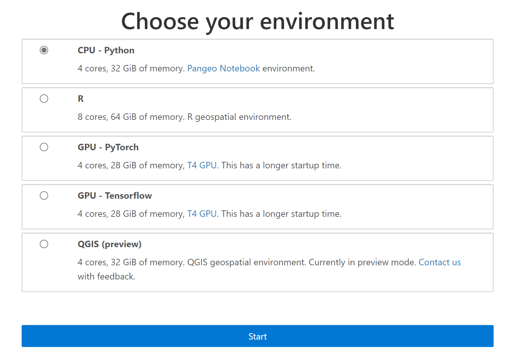
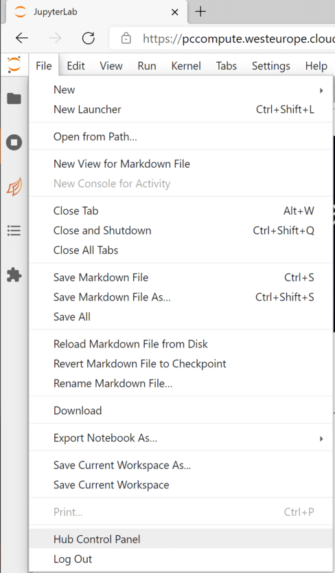
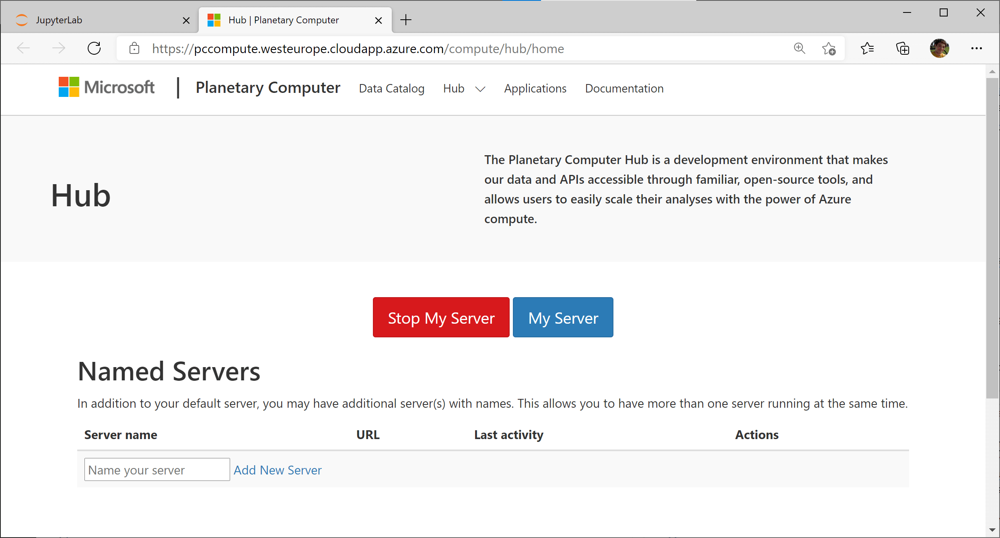

# Planetary Computer Hub

The Planetary Computer Hub is a convenient option for computing on the [data](https://planetarycomputer.microsoft.com/catalog) provided by the Planetary Computer. The Hub is a [JupyterHub](https://jupyterhub.readthedocs.io/en/stable/) deployment that includes a set of commonly used packages for geospatial and sustainability data analysis. It's enabled with [Dask](https://dask.org/) for scalable computing.

## Logging in

Once you have an [account](https://planetarycomputer.microsoft.com/account/request) on the Planetary Computer, you can log into the Hub. Visit [http://planetarycomputer.microsoft.com/compute](http://planetarycomputer.microsoft.com/compute) to access the Hub.


The Hub offers several *profiles* to customize your computing environment. The profile determines the computing power and software environment of your server.



Select a profile and click *Start* to start your server. You'll see a progress bar and some logs as your server comes online. Once it's ready you'll be redirected to Jupyterlab.

## Stopping your server

When you're done with your session on the hub, make sure to stop your server to release the resources your consuming. From the Jupyterlab UI, select *File > Hub Control Panel*. This will open a new tab at [https://pccompute.westeurope.cloudapp.azure.com/compute/hub/home](https://pccompute.westeurope.cloudapp.azure.com/compute/hub/home), which lets you manage your servers.



Select *Stop My Server* to stop your server and release all of the resources you're consuming.



Note that we will automatically stop servers that seem to be idle.

## Using JupyterLab

The [JupyterLab User Guide](https://jupyterlab.readthedocs.io/en/stable/user/interface.html) describes the JupyterLab User Interface in detail. The Hub environments include a few common extensions.

* Dask Labextension: Dask diagnostics from within jupyterlab. See [Scale with Dask](quickstarts/scale-with-dask/) for more (Python only).
* GeoJSON rending with [jupyterlab-geojson](https://github.com/jupyterlab/jupyter-renderers/tree/master/packages/geojson-extension).

## Understanding the file-system

Your server has a **home directory** at `/home/jovyan/` where you can store local files. This directory persists across sessions; if you create a file in `/home/jovyan/`, stop your server, and start it up again that file will still be there.

Everything *outside* of `/home/jovyan` is *not* persisted across sessions. For example, if you make a modification to the Python environment at `/srv/conda/envs/notebook` by manually `pip install`ing a package, that new package will not be available after stopping and starting your server.

You should only store code, notebooks, and analysis documents in your home directory.
Notably, you shouldn't store large amounts of data in your home directory. Instead, use something like [Azure Blob Storage](https://docs.microsoft.com/en-us/azure/storage/blobs/storage-blobs-introduction) instead (make sure to use the West Europe region, which is where your server is running).

## Environment Variables

We set several environment variables when your server is started.

Variable                | Value         | Description
----------------------- | ------------- | -----------
PC_SDK_SUBSCRIPTION_KEY | unique to you | Used to [sign assets](../concepts/sas) to download data.

## Understanding the software environment

Your software environment is determined by the profile you selected when starting your server. It's a [conda environment](https://docs.conda.io/projects/conda/en/latest/user-guide/tasks/manage-environments.html) located at ``/srv/conda/envs/notebook``. The environment contains many software libraries that are helpful for geospatial data analysis. As mentioned [above](#Understanding-the-file-system) changes to the environment outside of your home directory are not persisted across sessions. If you ``pip`` or ``conda`` install a package, it will not be present the next time you start your server.

If you're using Dask for scalable computing, you should ensure that modifications you make to your local software environment are present on the workers too. Dask provides a [PipInstallPlugin](https://distributed.dask.org/en/latest/plugins.html#distributed.diagnostics.plugin.PipInstall) to automatically install packages when workers start

```python
>>> from dask.distributed import PipInstall
>>> plugin = PipInstall(packages=["scikit-learn"], pip_options=["--upgrade"])
>>> client.register_worker_plugin(plugin)
```

Note that this will slow down worker startup, since the packages will need to be found and downloaded before the worker can start executing tasks.