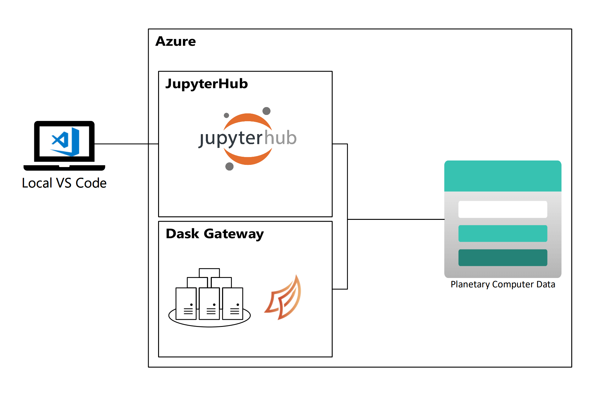

# Use Visual Studio Code

You can connect to the Planetary Computer Hub using [VS Code](https://code.visualstudio.com/). With this setup, you use a local instance of Visual Studio Code (installed on your laptop or Desktop computer) to connect to a remote Jupyter Kernel running in the Planetary Computer Hub.



You might choose this setup because you prefer VS Code as an editing environment and have configured your local instance to your taste. But you also value all the benefits of computing in the Planetary Computer Hub, things like having compute physically close to the data hosted by the Planetary Computer or not having to manage a Python environment.

The *files* you're working with will be stored on your local machine's hard drive. They will be executed in Azure, next to the data. We recommend cloning the [Planetary Computer Examples](https://github.com/Microsoft/PlanetaryComputerExamples) repository.


## Configure VS Code

This setup requires configuring your local VS Code installation.

1. **[Log into the Hub](https://pccompute.westeurope.cloudapp.azure.com/compute/hub/spawn)**.
   Currently you must start a notebook server by visiting the hub prior to connecting from VS Code.

2. **Install the [Jupyter Extension for Visual Studio Code](https://marketplace.visualstudio.com/items?itemName=ms-toolsai.jupyter)**.
   You can install the Jupyter Extension from [its website](https://marketplace.visualstudio.com/items?itemName=ms-toolsai.jupyter) or from within VS Code using the Extensions manager.

3. **Create a JupyterHub API Token**.
   Visit [http://planetarycomputer.microsoft.com/compute/hub/token](http://planetarycomputer.microsoft.com/compute/hub/token) to create an API token so that JupyterHub knows who you are when you try to connect from VSCode.

   ```{warning} This token is private and should not be shared publicly!
   ```

4. **Connect from VSCode**.

   Using the VS Code Command Palette, select "Jupyter: Specify local or remote Jupyter server for connections".

   

   Then select **Existing** to specify the RUI of an existing server.

   

   Finally, input your connection string, which should look like `https://pccompute.westeurope.cloudapp.azure.com/compute/user/<YOUR_EMAIL>/?token=<YOUR_TOKEN>`

   

   The components in that URI are:

   - The Hub address: https://pccompute.westeurope.cloudapp.azure.com/compute
   - `/user/`
   - Your username: Probably your email address. Get this from the URL in your browser when you sign into the Hub.
   - `/?token=`
   - The token you just generated at [on the Hub](http://planetarycomputer.microsoft.com/compute/hub/token).

5. **Press "Enter" to connect to that kernel**.

   Then reload the Jupyter extension and you should be connected.

VS Code will save this configuration. The next time you connnect you just need to start your server and select that existing connection string.